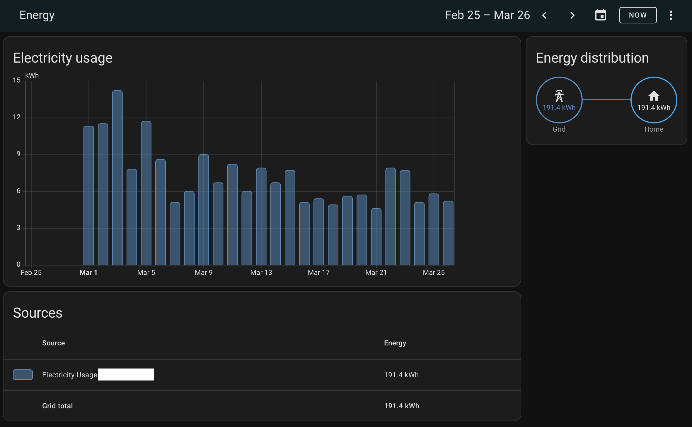
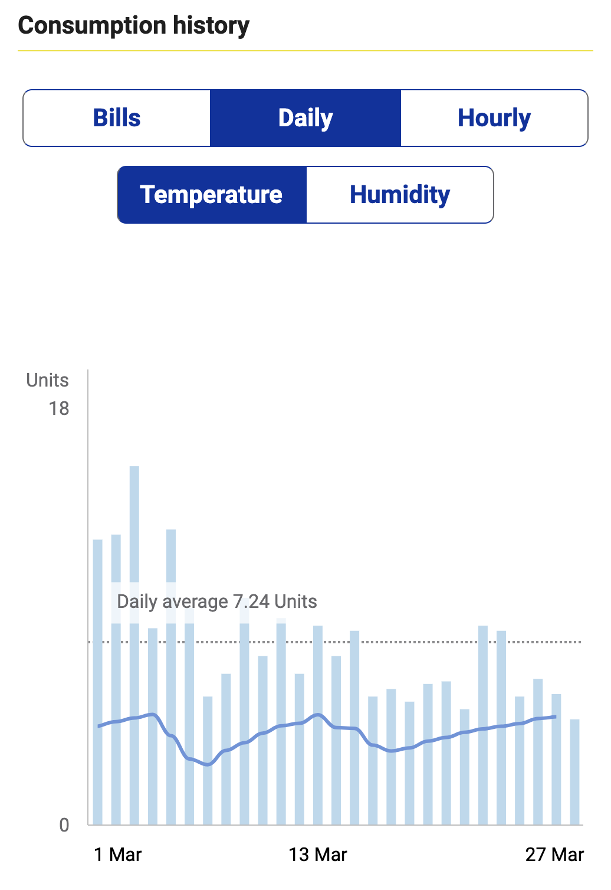

# HK CLP Consumption for Home Assistant

A custom component for Home Assistant that integrates with Hong Kong CLP to fetch and display electricity consumption data.



### Original dashboard from CLP 


## Features

- Fetches daily electricity consumption data from CLP
- Displays historical consumption data in Home Assistant
- Supports multiple CLP accounts
- Automatic data updates
- Secure credential handling

## Installation

1. Copy the all files within `custom_component` directory to your Home Assistant's `config/custom_components/hk_clp_consumption` directory.
2. Restart Home Assistant.

## Configuration

### UI Configuration

1. Go to **Settings** > **Devices & Services**
2. Click **+ ADD INTEGRATION**
3. Search for "HK CLP Consumption"
4. Enter your CLP account credentials:
   - Username (CLP account number)
   - Password (Must be hash, you could find it in CLP login response)
   - Login Endpoint (default: https://api.clp.com.hk/ts1/ms/profile/accountManagement/loginByPassword)
   - Consumption Endpoint (default: https://api.clp.com.hk/ts1/ms/consumption/history)

### Manual Configuration

Add the following to your `configuration.yaml`:

```yaml
hk_clp_consumption:
  - username: your_clp_account_number
    password: your_clp_password_hash
    login_endpoint: https://api.clp.com.hk/ts1/ms/profile/accountManagement/loginByPassword
    consumption_endpoint: https://api.clp.com.hk/ts1/ms/consumption/history
    stat_label_electricity_usage: "electricity_usage_label"
```

## Usage

After configuration, the component will:
1. Automatically fetch your electricity consumption data
2. Display the data in Home Assistant's statistics
3. Update the data during HASS startup

You can view your consumption data in:
- Home Assistant's Energy Dashboard
- Statistics Cards
- Custom dashboards

## Troubleshooting

If you encounter issues:

1. Check the Home Assistant logs for error messages
2. Verify your CLP credentials are correct
3. Ensure your Home Assistant instance has internet access
4. Check if the CLP API endpoints are accessible

## Development

### Project Structure

```
custom_components/hk_clp_consumption/
├── __init__.py
├── manifest.json
├── const.py
├── config_flow.py
├── hk_clp.py
└── util.py
```

### Contributing

1. Fork the repository
2. Create a feature branch
3. Commit your changes
4. Push to the branch
5. Create a Pull Request

## License

This project is licensed under the MIT License - see the LICENSE file for details.